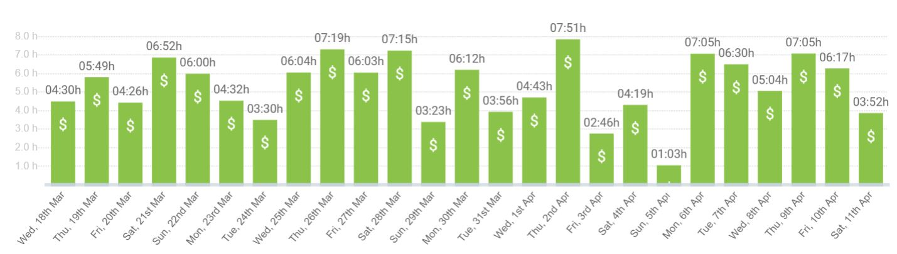

# 100-Days-of-Code-Challenge

### Why I Started This Project

- 25/03/2020: People in my Coder Academy cohort decided to create a stand-up channel on Slack, so we can share our achievements, blockers and goals with each other and keep us motived 💪 (Special credit to Harry :star:).

- 08/04/2020: I decided to also keep a copy on my GitHub to remind myself how far I've come. 👑😊

- 12/04/2020: Decided to incorporate the concepts of '100 Days of Code' challenge into this repo (I record entries every day and push them to GitHub weekly).

<!-- - Weekly Reflection & Goals for Next Week :heavy_check_mark: -->

---

**Day 87 Stand up | 12/06**

Yesterday

- 1000-1400 INCO Academy Workshop 8 :heavy_check_mark:
- Interview prep (Company AGS) :heavy_check_mark:
- 1500 Interview (Company AGS): The company was nice enough to accommodate my time, so we had a video interview with the HR & IT lead, which was great. :heavy_check_mark:

Today

- TBD: Will try to learn Vue or build a game in React or something else lol
- 1800 Catch up with coders

---

**Day 86 Stand up | 11/06**

Yesterday

- Data structure & algorithm course: Colt Steele (Section 24: Binary Heaps) :heavy_check_mark:
- Interview prep & video interview (Company V) :heavy_check_mark:
  (I recorded 9 videos for this interview... now I feel like a YouTuber lol)

Today

- 1000-1400 INCO Academy Workshop 8
- Interview prep (Company AGS)
- 1500 Interview (Company AGS): I didn't realise that the company wanted to have an on-site interview (I thought it was just a phone screening), so this one might be cancelled or rescheduled. I wrote an email to the manager to apologise for the misunderstanding, and asked if he would like to have an initial phone interview at 3 pm today. And we can have another on-site one if everything goes well today. Still awaiting reply.

---

**Day 85 Stand up | 10/06**

Yesterday

- 1000-1400 INCO Academy Workshop 7 :heavy_check_mark:
- 1500 Interview (Company A) :heavy_check_mark:
- Job applications*4 :heavy_check_mark:
- Data structure & algorithm course: Colt Steele (Section 24: Binary Heaps) :heavy_check_mark:
- Updated CV (based on feedback from my INCO cohort) :heavy_check_mark:

Today

- Interview prep & video interview (Company V)
- Data structure & algorithm course: Colt Steele (Section 24: Binary Heaps)

---

**Day 84 Stand up | 09/06**

Yesterday

- Interview prep (Company A) :heavy_check_mark:

Today

- 1000-1400 INCO Academy Workshop 7
- 1500 Interview (Company A)
- Data structure & algorithm course: Colt Steele (Section 24: Binary Heaps)
- Job applications

---

**Day 83 Stand up | 08/06**

Yesterday

- Company M - Online cognitive assessment :heavy_check_mark:
- Data structure & algorithm course: Colt Steele (Section 24: Binary Heaps) :heavy_check_mark:
- Interview prep (Company A) :heavy_check_mark:
- Weekly Reflection & Goals for Next Week :heavy_check_mark:

Today

- Interview prep (Company A)

---

**Day 82 Stand up | 07/06**

Yesterday

- Data structure & algorithm course: Colt Steele (Section 10: Searching Algorithms) :heavy_check_mark:
- Job applications* 8 :heavy_check_mark:
- Interview prep (Company A) :heavy_check_mark:
- Running: 3kms :running:

Today

- Company M - Online cognitive assessment
- Data structure & algorithm course: Colt Steele (Section 24: Binary Heaps)
- Interview prep (Company A)
- Weekly Reflection & Goals for Next Week

---

**Day 81 Stand up | 06/06**

Yesterday

- Interview prep (Company P) & phone screening at 3pm :heavy_check_mark:
- INCO Academy Assignment 6 :heavy_check_mark:
- Data structure & algorithm course: Colt Steele (Section 23: Tree Traversal) :heavy_check_mark:

Today

- Data structure & algorithm course: Colt Steele (Section 10: Searching Algorithms) 
- Interview prep (Company A)

---

**Day 80 Stand up | 05/06**

Yesterday

- 1000-1400 INCO Academy Workshop 6 :heavy_check_mark:
- Interview prep (Company A) :heavy_check_mark:
- Running: 4kms :running:

Today

- Interview prep (Company P) & phone screening scheduled at 3 pm 
- INCO Academy Assignment 6
- Data structure & algorithm course: Colt Steele (Section 23: Tree Traversal) 
- Interview prep (Company A)

---

**Day 79 Stand up | 04/06**

Yesterday

- Data structure & algorithm course: Colt Steele (Section 22: Binary Search Trees) :heavy_check_mark:
- BAHR Workshop 4 :heavy_check_mark:
- Updated cover letter, 2 job applications, 2 internship applications :heavy_check_mark:
- Walking: 3kms :running:

Today

- 1000-1400 INCO Academy Workshop 6 
- BAHR Workshop 4
- Interview prep (Company A)

---

**Day 78 Stand up | 03/06**

Yesterday

- Data structure & algorithm course: Colt Steele (Section 21: Stacks & Queues) :heavy_check_mark:
- INCO Academy Assignment 5 (SEO research & implantation) :heavy_check_mark:
- Job applications*4 :heavy_check_mark:

Today

- Data structure & algorithm course: Colt Steele (Section 22: Binary Search Trees)
- BAHR Workshop 4

---

**Day 77 Stand up | 02/06**

Yesterday

- 1000-1400 INCO Academy Workshop 5 :heavy_check_mark:
- BAHR: Assignment 3.2 :heavy_check_mark:
- Updated CV, set up custom domain for my portfolio site :heavy_check_mark:

Today

- INCO Academy Assignment 5 
- Data structure & algorithm course: Colt Steele (Section 21: Stacks & Queues)
- Job applications

---

**Day 76 Stand up | 01/06**

Yesterday

- Weekly Reflection & Goals for Next Week :heavy_check_mark:
- BAHR: Assignment 3.1 :heavy_check_mark:
- Running: 3kms :running:

Today

- 1000-1400 INCO Academy Workshop 5
- BAHR: Assignment 3.2
- 1800-1900 Let's learn Vue together

---

**Day 75 Stand up | 31/05**

Yesterday

- Data structure & algorithm course: Colt Steele (Section 20: Doubly Linked Lists) :heavy_check_mark:
- BAHR: Workshop 2 & 3 :heavy_check_mark:
- Running: 3kms :running:

Today

- BAHR: Assignment 3.1/3.2/3.3
- Weekly Reflection & Goals for Next Week 

---

**Day 74 Stand up | 30/05**

Yesterday

- Data structure & algorithm course: Colt Steele (Section 20: Doubly Linked Lists) :heavy_check_mark:
- job applications*4 :heavy_check_mark:
- Just JavaScript 09 :heavy_check_mark:
- BAHR: Workshop 1 :heavy_check_mark:

Today

- Data structure & algorithm course: Colt Steele (Section 20: Doubly Linked Lists) 
- BAHR: Workshop 2
- Running

---

**Day 73 Stand up | 29/05**

Yesterday

- 1000-1400 INCO Academy Workshop 4 :heavy_check_mark:
- INCO Academy Assignment 4 (a coding assignment... I just smashed it lol) :heavy_check_mark:
- Data structure & algorithm course: Colt Steele (Section 19: Singly Linked Lists) :heavy_check_mark:
- Running: 5kms :running:

Today

- Data structure & algorithm course: Colt Steele (Section 20: Doubly Linked Lists)
- job applications
- Just JavaScript 09
- BAHR

---

**Day 72 Stand up | 28/05**

Yesterday

- 1000-1330, 1630-2130 INCO Academy assignment 3 group meetings :heavy_check_mark:
- Data structure & algorithm course: Colt Steele (Section 18: Data Structures Introduction & Section 19: Singly Linked Lists) :heavy_check_mark:
- job applications\*5 :heavy_check_mark:

Today

- 1000-1400 INCO Academy Workshop 4 (I'm going to give a presentation of the group assignment today. Wish me luck!)
- Data structure & algorithm course: Colt Steele (Section 19: Singly Linked Lists)

---

**Day 71 Stand up | 27/05**

Yesterday

- Data structure & algorithm course: Stephen Grider (section 15 & 16) :heavy_check_mark:
- 1700-1745 INCO Academy assignment 3 group meeting  :heavy_check_mark:
- Running: 4kms :running:

Today

- Data structure & algorithm course: Colt Steele (Section 18: Data Structures Introduction)
- 1000 INCO Academy assignment 3 group meeting
- job applications

---

**Day 70 Stand up | 26/05**

Yesterday

- 1000-1400 INCO Academy Workshop 3 :heavy_check_mark:
- Data structure & algorithm course: Colt Steele (section 9) :heavy_check_mark:

Today

- Data structure & algorithm course: Stephen Grider (section 15 & 16)
- TBD: might work on side projects or something else

---

**Day 69 Stand up | 25/05**

Yesterday

- Data structure & algorithm course: Colt Steele (section 7 & 8) :heavy_check_mark:
- Weekly Reflection & Goals for Next Week :heavy_check_mark:
- 1830-1900 Meetup - Career-Building Learning Jam by Catalin Pit :heavy_check_mark:

Today

- 1000-1400 INCO Academy Workshop 3
- Data structure & algorithm course: Colt Steele (section 9)

---

**Day 68 Stand up | 24/05**

Yesterday

- Change CV background & job apps\*8 :heavy_check_mark:

Today

- Data structure & algorithm course: Colt Steele (section 7)
- Weekly Reflection & Goals for Next Week
- 1830 Meetup Career-Building Learning Jam by Catalin Pit

---

**Day 67 Stand up | 23/05**

Yesterday

- INCO Academy: assignment 2 :heavy_check_mark:
- Data structure & algorithm course: Stephen Grider (section 27 & 28) :heavy_check_mark:
- Course: Interviewing for Front-End Engineers - Jem Young :heavy_check_mark:

Today

- Data structure & algorithm course: Colt Steele (section 7)
- Change CV background & job apps

---

**Day 66 Stand up | 22/05**

Yesterday

- 1000-1400 INCO Academy: Get Into Tech Program 2 :heavy_check_mark:
- Data structure & algorithm course: Stephen Grider (section 25 & 26) :heavy_check_mark:
- Course: Interviewing for Front-End Engineers - Jem Young :heavy_check_mark:
- Job applications\*1 (internship) :heavy_check_mark:

Today

- INCO Academy: assignment 2
- Data structure & algorithm course: Stephen Grider (section 27 & 28)
- Course: Interviewing for Front-End Engineers - Jem Young

---

**Day 65 Stand up | 21/05**

Yesterday

- Data structure & algorithm course: Colt Steele (section 6) :heavy_check_mark:
- 1400-1600 GraphQL for React Developer workshop :heavy_check_mark:
- Job applications\*11 :heavy_check_mark:

Today

- 1000-1400 INCO Academy: Get Into Tech Program 2
- Data structure & algorithm course: Stephen Grider (section 25)

---

**Day 64 Stand up | 20/05**

Yesterday

- INCO Academy: Studied WordPress & completed assignment 1 (see my project here: http://git157.dreamhosters.com/) :heavy_check_mark:

  With WordPress, there’s no need to set up routers like React and no need to worry about responsiveness in CSS (it's responsive by default). You can build a simple website without coding a single line… No wonder it's such a powerful & popular too! Although I still prefer to build a website by actual coding 😆

Blockers

- So many things just jumped on my way. Didn't study algorithms for two days :sob:

Today

- Data structure & algorithm course: Colt Steele (section 6)
- 1400-1600 GraphQL for React Developer workshop
- Job applications

---

**Day 63 Stand up | 19/05**

Yesterday

- 1000-1400 INCO Academy: Get Into Tech Program 1 :heavy_check_mark:
- Job applications\*3 :heavy_check_mark:
- Email screening (Company TW) :heavy_check_mark:
- Had a catch up with Nina ♥️

Today

- Data structure & algorithm course: Colt Steele (section 6)
- INCO Academy: study WordPress & work on assignment 1

---

**Day 62 Stand up | 18/05**

Yesterday

- Data structure & algorithm course: Colt Steele (section 6) :heavy_check_mark:
- Weekly Reflection & Goals for Next Week :heavy_check_mark:
- Running: 4kms :running:

Today

- 1000-1400 INCO Academy: Get Into Tech Program 1
- Data structure & algorithm course: Colt Steele (section 6)
- Job applications

---

**Day 61 Stand up | 17/05**

Yesterday

- 0900-1800 ngGrils Angular workshop: I won the 2nd place of three Angular quizzes 👑

Today

- Data structure & algorithm course: Colt Steele (section 6)
- Weekly Reflection & Goals for Next Week

---

**Day 60 Stand up | 16/05**

Yesterday

- CV update & twitter post: Spent another 3hrs on refining my CV :heavy_check_mark:
- Data structure & algorithm course: Colt Steele (section 6) :heavy_check_mark:
- Side project: RPSLS-game (planning & setup) :heavy_check_mark:

Today

- 0900-1800 ngGrils Angular workshop: https://ng-girls.org/australia-2020/

---

**Day 59 Stand up | 15/05**

Yesterday

- Data structure & algorithm course: Colt Steele (section 5) :heavy_check_mark:
- CSS: srcset & sizes attributes on images :heavy_check_mark:
- 1600-1700 MYOB Info session :heavy_check_mark:
- 1830-1900 meetup - Coder Academy: Coder Callback Virtual :heavy_check_mark:
  (Around 50 current students, recent graduates & alumni from all three campuses attended the virtual meetup yesterday. I shared the info regarding Women of React Virtual conference and 2 tech podcasts there.)
- Job applications\*5 :heavy_check_mark:

Today

- CV update & twitter post
- Data structure & algorithm course: Colt Steele (section 6)
- Side project: RPSLS-game (planning & setup)

---

**Day 58 Stand up | 14/05**

Yesterday

- Girls in Tech Virtual Conference (2 talks) :heavy_check_mark:
- Data structure & algorithm course: Colt Steele (section 5) & Stephen Grider (section 29) :heavy_check_mark:
- Running: 4kms :running:
- Explored Frontend Mentor (picked 2 projects):heavy_check_mark:

Today

- Data structure & algorithm course: Colt Steele (section 5)
- CSS
- 1600-1700 MYOB Info session
- 1830-2030 Coder Academy meetup - Coder Callback Virtual

---

**Day 57 Stand up | 13/05**

Yesterday

- Side projects (COVID-19): Improved styling and responsiveness (really needed a designer to help with the design lol) :heavy_check_mark:
- CSS: BEM CSS naming style :heavy_check_mark:
- Updated CV: added COVID-19 project :heavy_check_mark:
- 1700-1720 pm Meetup - Muses Career

Today

- Girls in Tech Virtual Conference: https://gitconaustralia.girlsintech.org/agenda/
- Data structure & algorithm course: Colt Steele (section 5)
- Exploring Frontend Mentor

---

**Day 56 Stand up | 12/05**

Yesterday

- Data structure & algorithm course: Stephen Grider (section 22-24) :heavy_check_mark:
- Side projects (COVID-19): styling and responsiveness ❌
- Running: 3kms :running:
- HTML & CSS Crash Course by Kevin Powell :heavy_check_mark:

Today

- Side projects (COVID-19): styling and responsiveness
- Job applications
- 1700-1900 Meetup - Muses Career: https://us02web.zoom.us/j/89267522621?pwd=RFgwd0VNN3BieVRHSjhpbFJUbWJqdz09

---

**Day 55 Stand up | 11/05**

Yesterday

- Interview - Online test (Company W) :heavy_check_mark:
- CSS - Block, inline & inline-block elements :heavy_check_mark:
- Weekly Reflection & Goals for Next Week :heavy_check_mark:

Today

- Side projects (COVID-19): styling and responsiveness
- Data structure & algorithm course: Stephen Grider (section 22-24)
- Running

---

**Day 54 Stand up | 10/05**

Yesterday

- Interview prep - review data structure & algorithm (Company W) :heavy_check_mark:
- Conquering responsive layouts: day 21 - completed!!! :heavy_check_mark:
- Running 3kms :running:

Today

- Interview - Online test (Company W)
- CSS - Block, inline & inline-block elements
- Weekly Reflection & Goals for Next Week

---

**Day 53 Stand up | 09/05**

Yesterday

- Data structure & algorithm course: Stephen Grider (section 21) :heavy_check_mark:
- Reading: De-Coding The Interview Process (The Interview Process) :heavy_check_mark:
- Job applications\*1 :heavy_check_mark:

Today

- Interview prep - review data structure & algorithm (Company W)
- Conquering responsive layouts: day 21
- Data structure & algorithm course: Stephen Grider (section 22-24)
- Running

---

**Day 52 Stand up | 08/05**

Yesterday

- Data structure & algorithm course: Stephen Grider (section 19-20) & Colt Steele (section 4) :heavy_check_mark:
- Interview prep (Company W): 2 coding problem :heavy_check_mark:
- Running 3kms :running:

Today

- Data structure & algorithm course: Stephen Grider (section 21)

---

**Day 51 Stand up | 07/05**

Yesterday

- Conquering responsive layouts: day 19-20 :heavy_check_mark:
- Data structure & algorithm course: Colt Steele (section 3), Stephen Grider (section 5, 17-18) :heavy_check_mark:
- Interview prep (Company W): 1 coding problem :heavy_check_mark:
- Running 5kms :running:

Today

- Data structure & algorithm course: Stephen Grider (section 19-20) & Colt Steele (section 4)
- Interview prep (Company W): 2 coding problems

---

**Day 50 Stand up | 06/05**

Yesterday

- Conquering responsive layouts: day 15-18 :heavy_check_mark:
- Interview prep (Company W) :heavy_check_mark:
- Data structure & algorithm course: Colt Steele (BigO notation) :heavy_check_mark:

Today

- Conquering responsive layouts
- Data structure & algorithm course: Colt Steele
- Interview prep (Company W)

---

**Day 49 Stand up | 05/05**

Yesterday

- Interview prep (Company M) :heavy_check_mark:
- Online Interview (Company M) :heavy_check_mark:
- Job applications\*3 :heavy_check_mark:

Blockers

- After spending 2hrs preparing for the interview and another 3hrs for attending the interview (video recording & written response), I was exhausted... didn't do much afterwards lol

Today

- Conquering responsive layouts
- Data structure & algorithm course: Stephen Grider, Colt Steele

---

**Day 48 Stand up | 04/05**

Yesterday

- Conquering responsive layouts: day 14 :heavy_check_mark:
- Weekly Reflection & Goals for Next Week :heavy_check_mark:

Today

- Interview prep & interview (Company M)
- Conquering responsive layouts
- Data structure & algorithm course: Stephen Grider, Colt Steele

---

**Day 47 Stand up | 03/05**

Yesterday

- Conquering responsive layouts: day 13 :heavy_check_mark:
- Watched [Women of React Conference 2020 recording](https://www.youtube.com/watch?v=K8MF3aDg-bM&feature=youtu.be&t=13846). Also read Aishwarya Borkar's [writeup with links to timestamps](https://dev.to/ashc0des/women-of-react-2020-recap-51jf).

Today

- Conquering responsive layouts: day 14
- Weekly Reflection & Goals for Next Week
- Interview prep (Company M)
- Data structure & algorithm course: Stephen Grider, Colt Steele

---

**Day 46 Stand up | 02/05**

Yesterday

- Conquering responsive layouts: day 12 :heavy_check_mark:
- Data structure & algorithm course: Stephen Grider (section 1-4), Colt Steele :heavy_check_mark:
- Job applications\*3 :heavy_check_mark:
- Interview prep (Company M) :heavy_check_mark:

Today

- Conquering responsive layouts
- Data structure & algorithm course: Colt Steele
- Interview prep (Company M)

---

**Day 45 Stand up | 01/05**

Yesterday

- Angular Course: Angular CLI :heavy_check_mark: (Completed Angular: Getting Started by Deborah Kurata on Pluralsight)
- Side projects (COVID-19): code refactoring, docs, deployment :heavy_check_mark: (Still missing styling & responsiveness at the moment. Will come back the following week to finish it up.)
- Conquering responsive layouts: day 11 :heavy_check_mark:

Today

- Conquering responsive layouts
- Udemy data structure & algorithm course
- Job applications
- Interview prep (Company M)
- (if have time) Bored at Home React project

---

**Day 44 Stand up | 30/04**

Yesterday

- Angular course: Navigation & Routing Basics II :heavy_check_mark:
- Conquering responsive layouts: day 09 & 10 :heavy_check_mark:
- Interview: online culture assessment (Company W) :heavy_check_mark:
- Job applications\*3 :heavy_check_mark:
- Updated CV :heavy_check_mark:
- Running 3kms :running:

Today

- Angular course
- Side projects (COVID-19): styling, clock (refactoring)

---

**Day 43 Stand up | 29/04**

Yesterday

- Angular course: Navigation & Routing Basics :heavy_check_mark:
- Side projects (COVID-19): error-handling, theme-context, table & app.js (refactoring) :heavy_check_mark:
- Job applications\*1 :heavy_check_mark:
- Running 3kms :running:

Today

- Angular course
- Conquering responsive layouts
- Interview: online culture assessment (Company W)

---

**Day 42 Stand up | 28/04**

Yesterday

- Angular course: modules :heavy_check_mark:

Today

- Angular course
- Side projects (COVID-19): error-handling, theme-context, table (refactor)
- Job applications
- Running

---

**Day 41 Stand up | 27/04**

Yesterday

- Angular course: services & dependency injection :heavy_check_mark:
- Interview prep: Hacker Rank :heavy_check_mark:
- Interview (Company C): coding challenge on Hacker Rank :heavy_check_mark:
- Weekly Reflection & Goals for Next Week :heavy_check_mark:

Today

- Angular course

---

**Day 40 Stand up | 26/04**

Yesterday

- Job applications\*2 :heavy_check_mark:
- Angular course: services & dependency injection :heavy_check_mark:
- Side projects (COVID-19): update form (pagination) graph :heavy_check_mark:
- Interview prep: Hacker Rank :heavy_check_mark:

Today

- Angular course
- Interview prep: Hacker Rank
- Interview (Company C): coding challenge on Hacker Rank

---

**Day 39 Stand up | 25/04**

Yesterday

- Angular course: nested components, @Input() & @Output() decorators :heavy_check_mark:
- Side projects (COVID-19): graph :heavy_check_mark:
- Job applications\*4 :heavy_check_mark:
- Interview prep: Hacker Rank :heavy_check_mark:

Today

- Angular course
- Side projects (COVID-19): update form, add error handling
- Hacker Rank

---

**Day 38 Stand up | 24/04**

Yesterday

- Side projects (COVID-19): revisited development plan :heavy_check_mark:
- Angular course: interfaces, custom pipes, getter & setter :heavy_check_mark:
- Interview prep :heavy_check_mark:
- Phone interview (Company D):heavy_check_mark:

Today

- Angular course
- Side projects (COVID-19): graph
- Job applications
- Interview prep - Hacker Rank: Received a coding challenge at Hacker Rank, but I've never used it before. Need to get familiar with the interface.

---

**Day 37 Stand up | 23/04**

Yesterday

- Job applications \* 3 :heavy_check_mark:
- Side projects (COVID-19): table & social components :heavy_check_mark:
- Angular course: property binding, event binding, two-way data binding, pipes :heavy_check_mark:
- BAHR: exercises 1.5 :heavy_check_mark:
- 1745 - 1840 Meetup - Female Influencers In Tech (https://www.meetup.com/Female-Influencers-in-Tech/events/268849861/) :heavy_check_mark:

Today

- Angular course
- Side projects (COVID-19)
- Interview prep
- Phone interview (Company D)

---

**Day 36 Stand up | 22/04**

Yesterday

- Job applications \* 8 :heavy_check_mark:
- Side projects (COVID-19): refactored table component as API endpoint deprecated :heavy_check_mark:
- Running 3kms :running:

Blockers

- Spent too much time on social media & watching YouTube.

Today

- Angular course
- Side projects (COVID-19): continue refactoring table component
- (if have time) BAHR: exercises 1.5-1.6

---

**Day 35 Stand up | 21/04**

Yesterday

- Updated portfolio site with updated CV :heavy_check_mark:
- Redux course :heavy_check_mark:
- Conquering responsive layouts 5/6/7 :heavy_check_mark:

Today

- Job applications
- Redux course
- Side projects (COVID-19): social links

---

**Day 34 Stand up | 20/04**

Yesterday

- Job applications :heavy_check_mark:
- Short jQuery course :heavy_check_mark:
- Weekly Reflection & Goals for Next Week :heavy_check_mark:

Blockers

- Has been losing motivation for the past few days, but I'm still trying to achieve things bit by bit.

Today

- Update portfolio site with updated CV
- Job applications
- Redux course
- Conquering responsive layouts 5, 6

---

**Day 33 Stand up | 19/04**

Yesterday

- 1000-1300 Mentor at MusesCodeJS remote JavaScript workshop :heavy_check_mark:
- Conquering responsive layouts: Day 3 & 4 :heavy_check_mark:
- Job applications :heavy_check_mark:
- Running 5kms :running:

Today

- Job applications
- Short jQuery course

---

**Day 32 Stand up | 18/04**

Yesterday

- Update CV format based on employer's advice :heavy_check_mark:
- Job applications :heavy_check_mark:

Today

- 1000-1300 Mentor at MusesCodeJS remote JavaScript workshop
- Conquering responsive layouts: Day 3 & 4
- Job applications

---

**Day 31 Stand up | 17/04**

Yesterday

- Redux course :heavy_check_mark:
- Job applications\*1 :heavy_check_mark:
- 1730-1820 MusesCodeJS - mentor session :heavy_check_mark:
- 1830-1930 GraphQL meetup: At the end of the session, I spoke up to advertise myself for jobs and my mentor (who happened to be at the same meetup) also spoke up to validate my internship performance. Such a nice gesture from him! :star:
- 1930-2030 Sydney CSS meetup :heavy_check_mark:

Today

- Redux course
- Update CV format based on employer's advice
- Job applications

---

**Day 30 Stand up | 16/04**

Yesterday

- Conquering responsive layouts: Day 2 :heavy_check_mark:
- Side projects (COVID-19): form component completed & general layout updated :heavy_check_mark:
- Bored at Home React project: workshop 1 :heavy_check_mark:
- Running 3kms :running:

Today

- Redux course
- Job applications
- Bored at Home React project: Workshop 1 exercises
- Conquering responsive layouts: Day 3
- 1730-1820 MusesCodeJS - mentor session
- 1830-1930 GraphQL meetup
- 1930-2030 Sydney CSS meetup: https://www.meetup.com/SydCSS/events/269869596/

---

**Day 29 Stand up | 15/04**

Yesterday

- Side projects (COVID-19): form component :heavy_check_mark:
- Just JavaScript (module 6 & 7) :heavy_check_mark:
- Jest (react-testing-library) :heavy_check_mark:
- 18:00-19:00 RORO Sydney meetup :heavy_check_mark:

Today

- Conquering responsive layouts - Day 2 (just did it this morning) :heavy_check_mark:
- Side projects (COVID-19): form component
- Bored at Home React project
- Running

---

**Day 28 Stand up | 14/04**

Yesterday

- Conquering responsive layouts - Day 1 :heavy_check_mark:
- Just JavaScript (module 4&5) :heavy_check_mark:
- Angular (template & structural directives) :heavy_check_mark:
- Walked/ran 5kms :running:

Blockers

- Really not in the mood to work on my side projects 😂

Today

- Side projects (COVID-19): form component
- Jest
- 18:00-20:15 RORO Sydney meetup

---

**Day 27 Stand up | 13/04**

Yesterday

- Weekly Reflection & Planning for Next Week :heavy_check_mark:
- Updated repo README (daily standups, React concepts) :heavy_check_mark:
- Posts on twitter & LinkedIn :heavy_check_mark:
- Jest: unit testing on React component (log in) :heavy_check_mark:

Today

- Side projects (COVID-19): form component
- Conquering responsive layouts
- Just JavaScript (module 4&5)
- Learn Angular

---

**Day 26 Stand up | 12/04**

Yesterday

- 3 meetup posts on Twitter :heavy_check_mark:
- Side projects (COVID-19): form component :heavy_check_mark:
- Jest: unit testing on React component (static form) :heavy_check_mark:

Blockers

- Had issues in using React Hooks to grab dynamic data from a public API & transfer the data into a dropdown menu. Need to re-consider my design and code implementation.

Today

- Weekly Reflection & Goals for Next Week
- Jest

---

**Day 25 Stand up | 11/04**

Yesterday

- Side projects (COVID-19): form component (used React hooks & a customised React hook :raised_hands:)
- Learned Angular (intro to Angular, intro to components) :heavy_check_mark:
- 1500-1530 Angular Sydney Meetup 'What's new in Angular 9' :heavy_check_mark:
- Learned Jest (test configurations) :heavy_check_mark:
- Job applications\*1 :heavy_check_mark:
- Walked/ran 3kms :running:

Today

- Side projects (COVID-19): form component
- Jest

---

**Day 24 Stand up | 10/04**

Yesterday

- Side projects (COVID-19): refactored table component :heavy_check_mark:
- Learned Jest (simple-react-test) :heavy_check_mark:
- Sent follow-up email to 1st company after coding challenges :heavy_check_mark:
- Job applications\*4 :heavy_check_mark:
- 1400-1500 Women in Tech Meetup: Finding jobs during social distancing (Great session! Tips were helpful!) :heavy_check_mark:
- 1700-1740 Frontend Tech Meetup: React Hooks and Redux etc :heavy_check_mark:

Today

- Side projects (COVID-19): form component
- 1500-1700 Angular Sydney Meetup 'What's new in Angular 9': https://www.meetup.com/Angular-Sydney/events/269886948/
- Learn Jest
- Learn Angular

---

**Day 23 Stand up | 09/04**

Yesterday

- Learned React-Redux (actions, stores, reducers/connect react to redux) :heavy_check_mark:
- Learned Jest (intro to testing/types of testing) :heavy_check_mark:
- Received a phone interview request, prepared and attended the interview. Received an invite to 2nd interview scheduled next week :heavy_check_mark:
- Wrote a post about how to keep motivated on social media :heavy_check_mark:
- Walked/ran 5kms :running:

Blockers

- Didn't have the time (or the mood to be exactly :stuck_out_tongue_closed_eyes:) to work on side projects
- Sometimes I think I know a fair bit about React, but sometimes I also feel like I know NOTHING about React :sob:

Today

- Side projects (COVID-19): form component
- Learning Jest
- 1400-1500 Meetup: Finding jobs during social distancing
- 1700-2000 Meetup: React Hooks and Redux etc

---

**Day 22 Stand up | 08/04**

Yesterday

- Finished coding challenge & responded to comments on PR :heavy_check_mark:
- Job application\*3 :heavy_check_mark:
- Learned React Redux :heavy_check_mark:
- Reviewed side projects (tic-tac-toe) :heavy_check_mark:
- Attended LevelUp-ThoughtWorks event :heavy_check_mark:

Today

- Learning React-Redux (continue)
- Learning Jest
- Side projects (COVID-19): form component

---

**Day 21 Stand up | 07/04**

Yesterday

- Finished tic-tac-toe game :heavy_check_mark:
- Deepened my understanding on react-router-dom :heavy_check_mark:
- Worked on coding challenge after passed initial interview :heavy_check_mark:

Blockers

- Lots of self-doubts :joy:

Today

- Finished coding challenge
- Learn React Redux
- Job applications
- Review what I've learned last week

---

**Day 20 Stand up | 06/04**

Weekend

- Job applications\*4 :heavy_check_mark:
- Continued building tic-tac-toe game :heavy_check_mark:
- Walked/ran 4kms :running:

Blockers

- From time to time, I lose motivation :joy:

Today

- Job applications
- Finish tic-tac-toe game
- Learn React (topic undecided yet)

---

**Day 17 Stand up | 03/04**

Yesterday

- Job application\*3 :heavy_check_mark:
- React docs: main concepts 9-12, lifecycle, hooks. Created a repo to share my note :heavy_check_mark:
- Interview preparation :heavy_check_mark:

Today

- Job applications
- Interview preparation
- Finish tic-tac-toe game

---

**Day 16 Stand up | 02/04**

Yesterday

- Job application\*5 :heavy_check_mark:
- React docs: main concepts 1-8 :small_red_triangle:
- Passed LinkedIn JSON assessment :heavy_check_mark:
- Walked/ran 4.5kms :running:

Today

- Job applications
- React docs(main concepts 9-12/life cycle/hooks)
- Interview preparation

---

**Day 15 Stand up | 01/04**

Yesterday

- Job application\*6 :heavy_check_mark:
- React docs: followed tutorial & built a tic tac toe game :heavy_check_mark:

Today

- Job applications
- React docs (read main concepts/life cycle/hooks), finish up the game

Additional

- Walked/ran for 3kms
- Got my first call from a job application and I screwed it up so bad. Lesson learned! :slightly_smiling_face:

---

**Day 14 Stand up | 31/03**

Yesterday

- Job application\*6 :heavy_check_mark:
- Side projects: built basic table :heavy_check_mark:

Blockers

- A person I know (worked as a frontend engineer) was made redundant (actually his whole engineering team was made redundant)... very disheartening :pensive::pensive::pensive:

Today

- Follow-up/Job applications
- Refresh React knowledge
- Side projects: continue with the comparison table

---

**Day 13 Stand up | 30/03**

Weekend

- Job applications\*7 :heavy_check_mark:
- Side projects: built basic clock :heavy_check_mark:
- Wrote post on WomenHack experience :heavy_check_mark:
- Passed LinkedIn assessment on Git/HTML/React :heavy_check_mark:

Today

- Follow-up/Job applications
- Side projects: continue with seasonal clocks & comparison table components

---

**Day 11 Stand up | 28/03**

Yesterday

- Job applications\*2 :heavy_check_mark:
- Side projects: components breakdown, time planning, started building seasonal clock :heavy_check_mark:
- Studied React with TypeScript :heavy_check_mark:

Blockers

- Took me more time in building seasonal clock component than expected. Need to work out how to estimate time/my capability better

Today

- Follow-up/apply to 2 jobs
- Write a post on WomenHack experience
- Side projects: build seasonal clock & comparison table components

---

**Day 10 Stand up | 27/03**

Yesterday

- Finished React refresher course :heavy_check_mark:
- Job applications\*1 :heavy_check_mark:
- Attended WomenHack & made connections :heavy_check_mark:
- Moved Medium posts to Twitter & got retweeted by official Sonic-Pi account :heavy_check_mark:
- Took LinkedIn CSS & JS quizzes :heavy_check_mark:

Blockers

- Overestimated time, didn’t have time to work on side projects :cry:

Today

- Follow-up/apply to 2 jobs
- Side projects: components breakdown, time planning, refresh TypeScript knowledge
- Write a post on WomenHack experience
- LinkedIn HTML quiz (if have time)

---

**Day 9 Stand up | 26/03**

Yesterday

- React refresher course :heavy_check_mark:
- Updated resume & Job applications\*3 (1 more than planned) :heavy_check_mark:
- Decided side projects idea, created simple wireframing :heavy_check_mark:
- Attended SEO meetup & wrote a post about it on LinkedIn :heavy_check_mark:

Today

- Finish React refresher course
- Apply to 1 job
- Start working on side projects (I’m writing a React App in TypeScript for this one, so need to refresh my TypeScript knowledge first)
- Attend WomenHack (an online recruiting event)

---

**Day 8 Stand up | 25/03**

Yesterday

- Fixed issues & adjusted styling of portfolio site :heavy_check_mark:
- Job applications\*2 & updated email signatures :heavy_check_mark:
- Moved all my LinkedIn posts to Medium :heavy_check_mark:

Blockers

- Felt lazy so I didn’t study React refresher course as planned :disappointed:

Today

- Continuing React refresher course
- Updating resume & apply to 2 jobs
- Brainstorming side projects ideas

---

**Day 1 | 18/03**

- The stand-up initiative was officially started later on 25/03/2020, but I've been coding since 18/03. Here I attached a screenshot from my time-tracker as a proof of continuous coding😊

---

©2020 Ellie Chen - All Rights Reserved.
